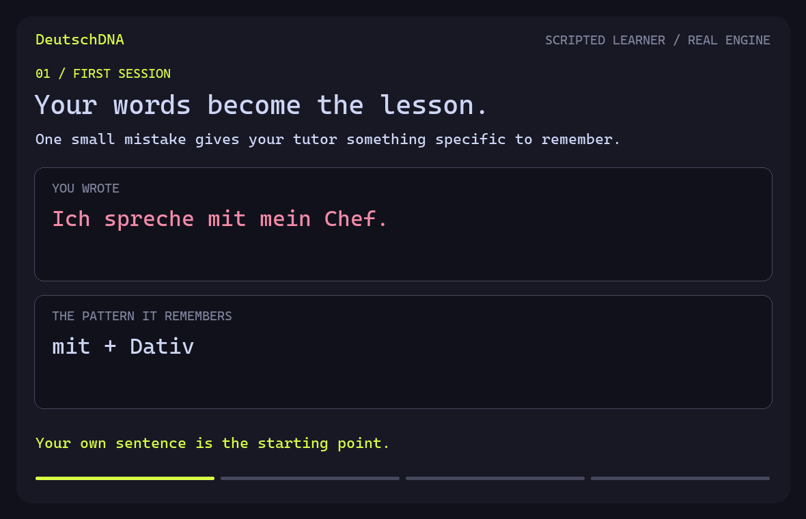
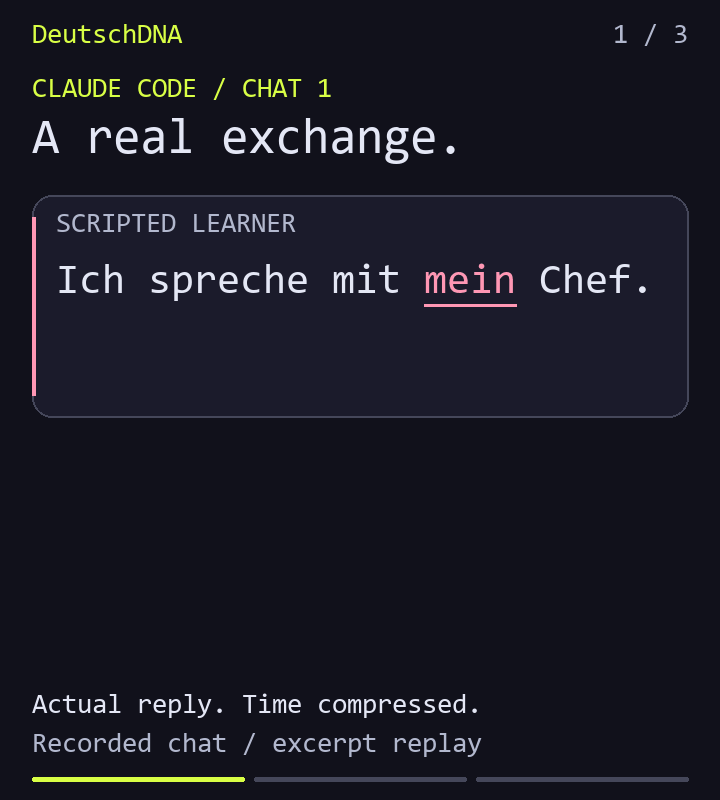
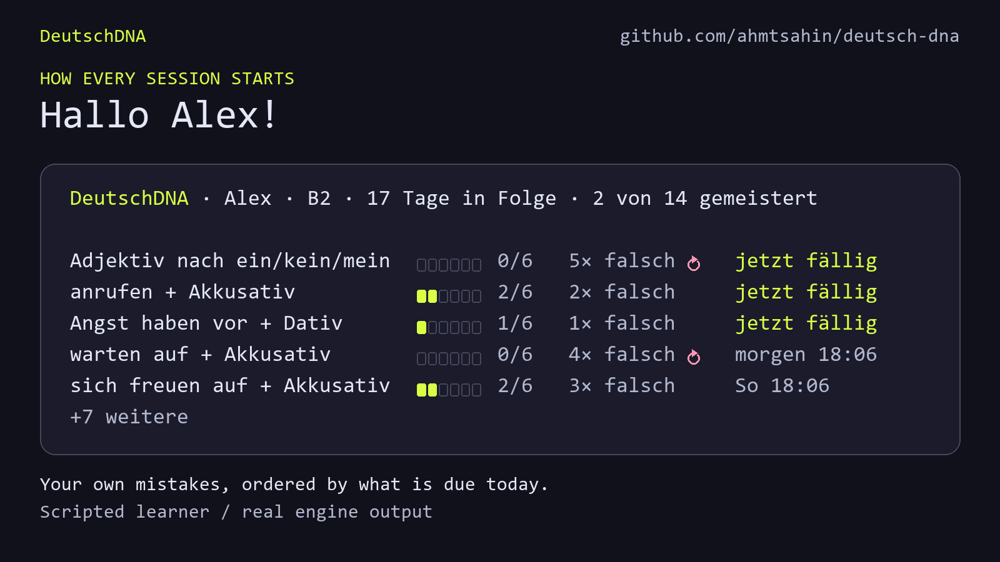

# DeutschDNA

**A German coaching skill for Claude Code and Codex.**

[](https://github.com/ahmtsahin/deutsch-dna/actions/workflows/tests.yml)

> You learn German. Your tutor remembers what helped.

Your tutor remembers your mistakes, the hints that helped, and your progress across conversations.

[Install and start](#install) · [Actual conversation](#an-actual-conversation) · [103 days later](#memory-over-months)

<p align="center">

</p>

**Yesterday: with a hint. Today: a new sentence, without help.**

Scripted learner inputs, real engine records. [View the result without animation](demo/learning-loop.png).

## Install

Requires **Python 3.10+** and Claude Code or Codex. No runtime packages, extra API key, server, or database to set up. Your existing model teaches; progress is stored locally in `~/.deutschdna`.

**Claude Code**

```bash
git clone https://github.com/ahmtsahin/deutsch-dna.git "$HOME/.claude/skills/deutsch-dna"
```

Start a chat with **`/deutsch-dna`**.

**Codex**

```bash
git clone https://github.com/ahmtsahin/deutsch-dna.git "$HOME/.agents/skills/deutsch-dna"
```

Start a chat with **`$deutsch-dna`**.

The tutor gives you one small German task right away. You can ask for explanations in your own language. Your name and goals are optional.

The clone commands work in macOS/Linux terminals and PowerShell. For project-only installation, Python on Windows, or the one-time permission setup that lets the tutor save progress, see [installation and permissions](docs/setup.md).

## An actual conversation

<p align="center">

</p>

**A new chat remembers the old hint.** This is a timed transcript replay of actual Claude Code replies to scripted learner messages. Both chats happened on the same day, using an isolated learning history. Displayed excerpts preserve the tutor's words; waiting time is compressed.

[Full conversation](demo/conversation.md) · [Captured replies and saved evidence](demo/conversation.json) · [Static view](demo/conversation.png)

## Every session starts with your board

<p align="center">

</p>

**Your patterns, what is due first, and which mistakes came back.** The tutor then quotes one of your own sentences and puts it in a new situation. This board belongs to the scripted four-month learner and comes straight from the engine.

## What you can do

| Say this | What happens |
| --- | --- |
| “Correct my German.” | Minimal corrections, with related mistakes grouped by their root cause. |
| “Give me a hint.” | You repair the sentence; the tutor remembers the help you needed. |
| “Let's review.” | Due patterns return in fresh situations. Copying the old answer cannot advance mastery. |
| “I have a meeting tomorrow.” | A roleplay can use your goal and a pattern you are practising. |
| “Let's practise words.” | Vocabulary from your scenes returns in spaced reviews. |
| “How am I doing?” | Your recorded progress, with the sentences behind it. |
| “That wasn't a mistake.” | The tutor can undo the correction and restore its schedule. |

During a roleplay, ordinary corrections wait until the debrief. Start with “Restoranda konuşalım” or “Roleplay Restaurant”; finish with “bitir” or “stop roleplay”. The reply includes up to three corrections and useful vocabulary.

[Your first minute, roleplays, and more examples](docs/practice.md).

## Memory over months

<p align="center">

</p>

**Your first mistake is still there when you need it.** This scripted four-month story runs through the real engine. The callback, original sentence, and saved hint come from its records. [Static view](demo/deutschdna.png).

The first example and teaching milestones survive the rolling history limits. Progress scores describe tracked patterns, not overall German proficiency. Text practice works directly; microphone capture and pronunciation scoring are not included.

## Try the engine

From the cloned skill folder:

```bash
python scripts/demo.py --learning-loop
```

This uses a fresh demo directory. For the four-month story, run `python scripts/demo.py`; for the restaurant scene, add `--speak`.

[CLI guide](docs/cli.md) · [Command contract](references/cli-contract.md) · [Tests, recording, and GIF generation](docs/development.md)

## Roadmap

- Planned: Goethe B1/B2, telc B1/B2, and telc Deutsch Beruf exam modes.
- Exploring: voice practice, pronunciation fingerprint, and a local dashboard.

## License

[MIT](LICENSE)
