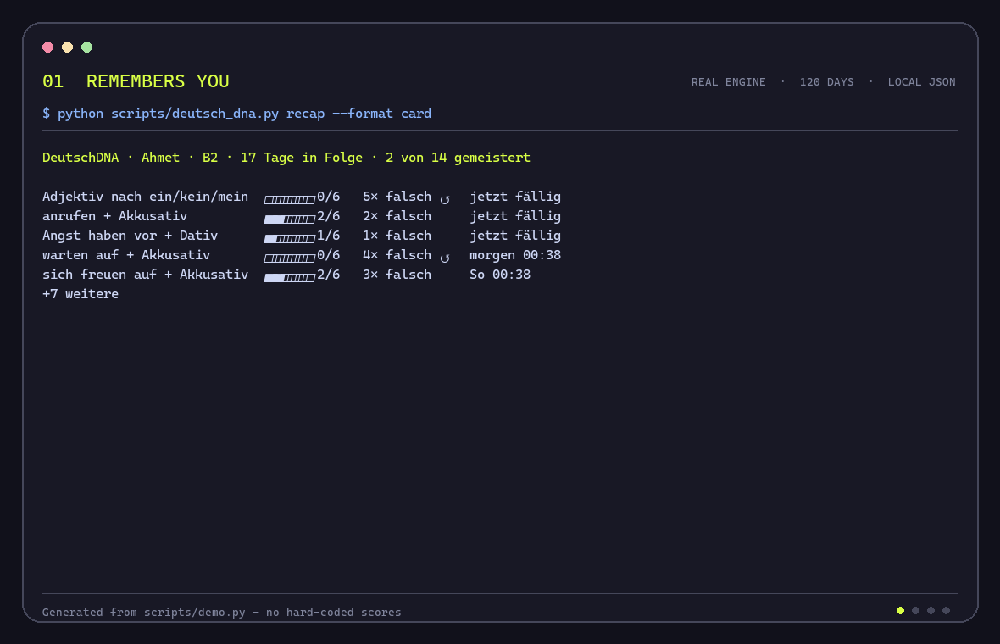

# DeutschDNA

> The German tutor that remembers every mistake you make, and brings each one back in a new sentence until you stop making it.

<!-- After running `vhs demo/deutschdna.tape`:  -->

DeutschDNA is an Agent Skill for Claude Code, Codex, and other agents that read the Agent Skills format. The model you already run does the teaching. One dependency-free Python file gives it a memory: every correction is filed under its root cause, every root cause comes back on a spaced-repetition schedule in a sentence you have not seen before, and all of it stays on your machine as plain JSON. No extra API key, no server, no database.

## See it in ten seconds

```bash
python scripts/demo.py
```

The demo replays four months of one learner through the real engine. The story only scripts what the learner wrote and how each review went. The engine decides when reviews happen and computes every number below.

### It remembers you

Every session opens the same way, never with a menu: two status lines printed by the CLI, one of the learner's own sentences, a new situation that asks for the same structure, and one line of what else to ask for.

```text
DeutschDNA · Ahmet · B2 · 17 Tage in Folge · 12 Muster · 2 gemeistert
Zuletzt zurück: weil sends finite verb to end ×2 · 3 Wiederholungen jetzt fällig

Gestern um 10:31 hast du geschrieben: „Das ist ein wichtige Termin."
Deine Kollegin fragt, was du am Wochenende gekauft hast. Beschreib es in einem Satz.

Außerdem: Text schicken · „Wiederholen" · „Rollenspiel Arzt" · „Wie stehe ich?"
```

The status lines are real CLI output for the demo learner, with times in the local time zone. The rest follows the format the skill asks the agent to use. Get it right, and the old sentence and the new one appear side by side. Get it wrong, and the mistake is caught on the spot. Either way the learner sees that the tutor remembers.

### It finds the root cause, not the symptom

```text
DeutschDNA · Ahmet · B2
14 patterns · 2 mastered · 29 wrong · 71 right · streak 17 days · 3 due

Artikel         ████████░░  78%   1 pattern  · 1 mastered · 1 wrong · 6 right
Kasus           ████████░░  77%   4 patterns · 1 mastered · 6 wrong · 22 right
Präpositionen   ███████░░░  69%   4 patterns · 0 mastered · 10 wrong · 24 right
Wortstellung    ██████░░░░  64%   2 patterns · 0 mastered · 3 wrong · 6 right
Endungen        ██████░░░░  55%   2 patterns · 0 mastered · 8 wrong · 10 right   ← weak
Plural          ███████░░░  67%   1 pattern  · 0 mastered · 1 wrong · 3 right

Root cause: Präpositionen · 5 of your 15 mistakes in 30 days · 4 related patterns
  → sich freuen auf + accusative
  → warten auf + accusative
  → sich interessieren für + accusative
  → Angst haben vor + dative
Also: Endungen · 5 of your 15 mistakes in 30 days · 2 related patterns

Weakest patterns
  weil sends finite verb to end     40%  2 wrong · 1 right · step 0/6
  adjective ending after der-word   50%  3 wrong · 3 right · step 2/6
  Angst haben vor + dative          50%  1 wrong · 1 right · step 1/6

Due now: adjective ending after ein-word · anrufen + accusative · Angst haben vor + dative
```

Four different mistakes, one missing rule: verbs with a fixed preposition. So the next drill is not *warten auf* again. It is the family, including members the learner has never missed: *denken an*, *sich erinnern an*, *teilnehmen an*.

### Every mistake has a story

```text
mit + dative · Kasus · mastered
Rule: mit always governs the dative

2026-05-14  ✗ wrote    Ich spreche mit mein Chef. → Ich spreche mit meinem Chef.
2026-05-15  ✓ review   Ich arbeite mit meinem Kollegen.
2026-05-18  ✓ review   Ich fahre mit dem Bus zur Arbeit.
2026-05-25  ✓ review   Ich telefoniere mit meiner Mutter.
2026-06-08  ✓ review   Wir essen mit unseren Nachbarn.
2026-07-08  ✓ review   Ich spreche mit einem Kunden.
2026-09-06  ✓ review   Ich bin mit dem Projekt zufrieden.
2026-09-06  ★ mastered
2026-09-10  ✓ used     mit unseren Kunden

████████░░ 80% · 1 wrong · 7 right · mastered
```

Every review is a new sentence, so the answer cannot be memorized. The last line is the learner using the structure correctly in real writing, unprompted.

### And it notices when an old one comes back

```text
warten auf + accusative · Präpositionen · learning
Rule: warten takes auf + accusative

2026-05-14  ✗ wrote    Ich warte dich. → Ich warte auf dich.
2026-05-15  ✓ review   Ich warte auf meinen Bruder.
2026-05-18  ✗ review   Ich warte den Zug. → Ich warte auf den Zug.
2026-05-19  ✓ review   Wir warten auf das Paket.
2026-05-22  ~ review   Ich warte auf deine Antwort. (after a hint)
2026-05-23  ✓ review   Sie wartet auf ihren Termin.
2026-05-30  ✗ review   Wir warten den Bus. → Wir warten auf den Bus.
2026-05-31  ✓ review   Ich warte auf eine E-Mail.
2026-06-03  ✓ review   Warte bitte auf mich!
2026-06-10  ✓ review   Er wartet auf den Arzt.
2026-06-24  ✓ review   Wie lange wartest du schon auf mich?
2026-07-24  ✓ review   Wir warten auf besseres Wetter.
2026-09-11  ✗ wrote    Ich warte meine Freundin. → Ich warte auf meine Freundin.

██████░░░░ 64% · 4 wrong · 8 right · step 0/6
```

So when the learner writes *Ich warte meine Freundin.*, the agent does not just fix it. Following the skill's correction protocol, it answers:

```text
Dein Satz
Ich warte meine Freundin.

Minimale Korrektur
Ich warte auf meine Freundin.

Warum
warten auf + Akkusativ

Prüfung
LanguageTool supports this correction.

Muster
warten auf + Akkusativ · nach 104 Tagen zurück · du warst schon bei Stufe 5 von 6
Am 14. Mai: „Ich warte dich." · heute: „Ich warte meine Freundin."
```

The **Muster** line is built from what the CLI returns when the mistake is recorded, never from the model's imagination. Tomorrow the pattern comes back in a sentence the learner has not seen.

## Why it is different

- **It starts with your own words.** Every session opens with a sentence you wrote and a new situation that asks for the same structure, not with a menu.
- **Root causes, not sentence pairs.** Most tutors store *wrong → right*. DeutschDNA stores *why*: `mit + Dativ`, `mit+dat.`, and `mit governs the dative` all resolve to one pattern, and related patterns roll up into a root cause.
- **Minimal corrections.** It fixes your sentence instead of rewriting it, so you can see your own mistake. A more natural version is labeled *Native alternative — not a correction*.
- **Allowed to say "I'm not sure."** Corrections can be checked against a local LanguageTool server. Disagreement is shown, not hidden, and uncertain corrections are not filed as your mistakes.
- **Spaced repetition for mistakes, not flashcards.** Reviews at 1, 3, 7, 14, 30, and 60 days. Any recurrence resets the ladder. Using the structure correctly in real writing on a day it is due counts as that review.
- **Honest numbers.** Nothing is scored before it has been tested: a fresh pattern shows *neu*, not 20%. Accuracy is smoothed and covers tracked patterns only.
- **Portable and private.** Plain JSON in `~/.deutschdna`. Nothing leaves your machine unless you explicitly allow a remote validator.

## Install

Clone this repository into the skill location for your agent. The directory must contain `SKILL.md`.

```text
# Claude Code, personal (all projects)
~/.claude/skills/deutsch-dna/

# Claude Code, one project
.claude/skills/deutsch-dna/

# Codex, repository-scoped
.agents/skills/deutsch-dna/
```

See the official [Claude Code skill guide](https://code.claude.com/docs/en/skills) and [Codex skill guide](https://developers.openai.com/codex/build-skills) for discovery rules. Python 3.10+ is required; nothing needs to be installed.

## Use it

Invoke it with `/deutsch-dna` in Claude Code or `$deutsch-dna` in Codex, or just write German and ask for feedback. It talks to you in German at your level. On the first run it asks for five or six sentences about your week and shows your first DeutschDNA: no scores yet, just the root cause behind most of your mistakes. From then on, every conversation opens with two status lines, one of your own sentences, and a new situation that asks for the same structure. A one-line hint lists what else you can ask for, and once a week the full profile comes back as a Wochenbilanz.

- **Correct my German.** Minimal correction, the reason, a verification label, and the recurrence callback when a mistake comes back.
- **Let's review.** One due mistake at a time, each in a new situation.
- **Roleplay Restaurant.** Scenes for Alltag, Arbeit, Arzt, Wohnung, and Restaurant. No interruptions; at most three corrections in the debrief.
- **How am I doing?** The DeutschDNA profile, the root cause behind your weakest area, and a family drill for it.
- **That wasn't a mistake.** The agent reverts just that correction with `undo`, schedule included, or fixes the entry with `merge`, `rename`, or `forget`.

## The CLI

The agent drives the CLI; you can use it directly too. Every command prints JSON; `recap`, `summary`, `due`, `list`, and `show` also take `--format text`.

```bash
python scripts/deutsch_dna.py init --name "Ahmet" --level B2 --native-language tr
python scripts/deutsch_dna.py record --original "Ich spreche mit mein Chef." --corrected "Ich spreche mit meinem Chef." --category case --pattern "mit + dative" --rule "mit always governs the dative"
python scripts/deutsch_dna.py summary --format text
```

| Command | What it does |
| --- | --- |
| `recap` | The session opener; `--format card` prints the two German status lines |
| `record` | File a mistake under its root cause, or count a recurrence |
| `observe` | Count a correct, unprompted use of a tracked pattern |
| `due`, `grade` | Spaced-repetition reviews |
| `summary` | The DeutschDNA profile with root causes |
| `show` | The journey of one pattern |
| `list`, `undo`, `forget`, `merge`, `rename` | Inspect and repair the memory |
| `verify` | Minimality check plus optional LanguageTool |
| `roleplay-start`, `roleplay-finish` | Stored roleplay sessions |

State lives in `~/.deutschdna`; set `DEUTSCHDNA_HOME` or pass `--home` before the command to use another directory. The full contract, including idempotency and scoring, is in [references/cli-contract.md](references/cli-contract.md).

## Verified corrections with LanguageTool

`verify` checks a LanguageTool-compatible `/v2/check` endpoint, `http://localhost:8081/v2/check` by default. LanguageTool's [embedded HTTP server guide](https://dev.languagetool.org/http-server.html) documents how to run it locally.

```bash
python scripts/deutsch_dna.py verify --original "Ich spreche mit mein Chef." --corrected "Ich spreche mit meinem Chef."
```

Override the endpoint with `--endpoint` or `LANGUAGETOOL_URL`. A non-local endpoint is refused unless you pass `--allow-remote` or set `DEUTSCHDNA_ALLOW_REMOTE_VALIDATOR=1`, because it sends your text off the machine. Without a server, correction and learning still work; the result is labeled *Not LanguageTool-verified* rather than pretending. LanguageTool is a second signal, not ground truth.

## Record the demo GIF

[`demo/deutschdna.tape`](demo/deutschdna.tape) renders the four screens above with [VHS](https://github.com/charmbracelet/vhs):

```bash
vhs demo/deutschdna.tape
```

It needs Python and bash; macOS, Linux, and WSL work out of the box. The output is `demo/deutschdna.gif`.

## Test

```bash
python -m unittest discover -s tests -v
```

## Roadmap

- v1.1: exam modes for Goethe B1/B2, telc B1/B2, and telc Deutsch Beruf
- v2: voice practice, pronunciation fingerprint, local dashboard

## License

MIT
