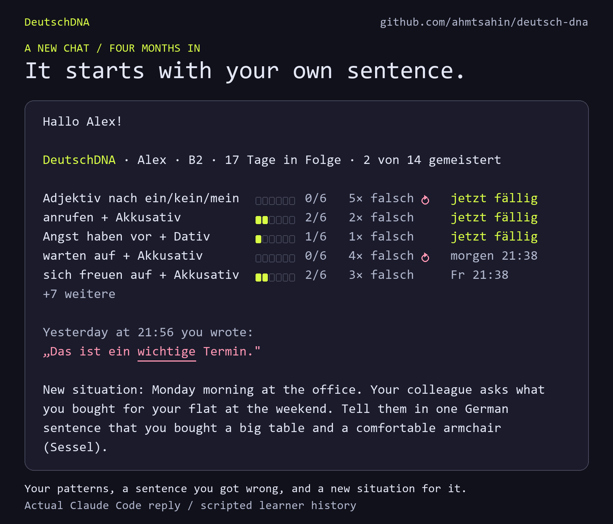
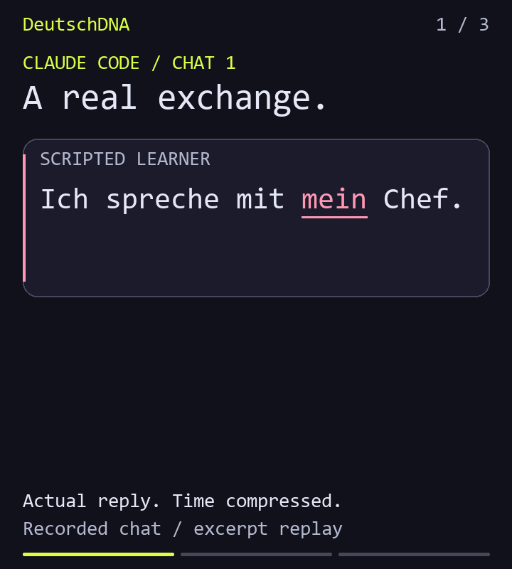
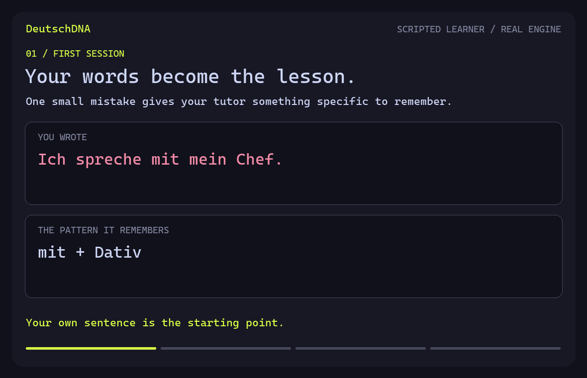
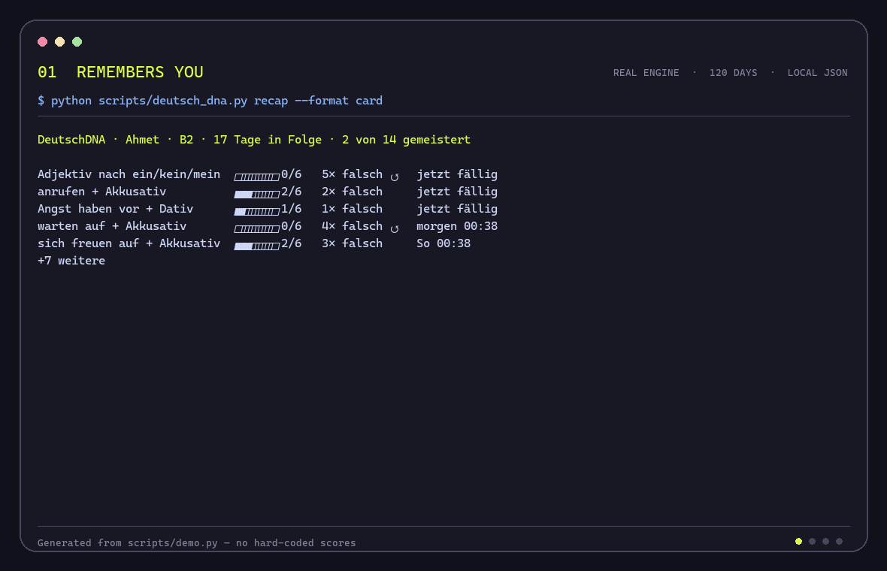
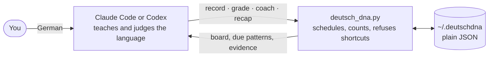

# DeutschDNA

**A German tutor that remembers your mistakes.**

It runs inside Claude Code and Codex. Every mistake is filed under its root cause and comes back in a new sentence until it stops. Your history stays on your own machine, and there is no extra API key.

[](https://github.com/ahmtsahin/deutsch-dna/actions/workflows/tests.yml)


[](LICENSE)

<p align="center">

</p>

**A new chat, four months in.** The tutor shows what is due, quotes a sentence you got wrong yesterday, and asks for a new one. This is an actual Claude Code reply to a scripted learner with four months of history. [Read the whole session](demo/session.md).

[Install](#install) · [Why not just a chatbot?](#why-not-just-ask-a-chatbot) · [One mistake over time](#one-mistake-over-time) · [How it works](#how-it-works)

## Install

Requires **Python 3.10+** and Claude Code or Codex. No runtime packages, extra API key, server, or database to set up. Your existing model teaches; progress is stored locally in `~/.deutschdna`.

**Claude Code**

```bash
git clone https://github.com/ahmtsahin/deutsch-dna.git "$HOME/.claude/skills/deutsch-dna"
```

Start a chat with **`/deutsch-dna`**.

**Claude Code, as a plugin**

```bash
claude plugin marketplace add ahmtsahin/deutsch-dna
claude plugin install deutsch-dna@deutsch-dna
```

Start a chat with **`/deutsch-dna:deutsch-dna`**.

**Codex**

```bash
git clone https://github.com/ahmtsahin/deutsch-dna.git "$HOME/.agents/skills/deutsch-dna"
```

Start a chat with **`$deutsch-dna`**.

The tutor gives you one small German task right away. You can ask for explanations in your own language. Your name and goals are optional.

The commands work in macOS/Linux terminals and PowerShell. Use either the cloned folder or the plugin, so that the skill appears once. For project-only installation, Python on Windows, or the one-time permission setup that lets the tutor save progress, see [installation and permissions](docs/setup.md).

## Why not just ask a chatbot?

You can, and the correction will be fine. Then the chat ends. Next week you write *mit mein Chef* again, and nothing notices.

| | A chat on its own | With DeutschDNA |
| --- | --- | --- |
| Your mistake | Corrected once | Filed under its root cause, with your sentence and the date |
| What you practise | Whatever you ask for | What is due: a pattern returns after 1, 3, 7, 14, 30, and 60 days |
| The exercise | Often the sentence you just saw | A new situation every time; repeats are refused |
| The hint that worked | Gone with the chat | Saved for the next time you are stuck |
| “You have improved” | Easy to say | Needs a new sentence, without help, on a later day |
| The record | Wherever the chat product keeps it | Plain JSON in `~/.deutschdna` that you can read, copy, or delete |

## What happens when you answer

The same recorded session, one message later:

```text
You     Ich habe einen großen Tisch und einen bequemen Sessel gekauft.

Tutor   Correct, with no help: einen großen Tisch and einen bequemen Sessel
        both carry the right ending.

        Yesterday: „Das ist ein wichtige Termin." · Today: „Ich habe einen
        großen Tisch und einen bequemen Sessel gekauft." ✓

        That pattern moves up to step 1/6 and comes back on Friday at 22:39.
```

Once a week, or when you ask “How am I doing?”, you get the profile that gives the project its name:

```text
DeutschDNA · Alex · B2
14 Muster · 2 gemeistert · 29× falsch · 72× richtig · 17 Tage in Folge · 2 fällig

Artikel         ████████░░  78%   1 Muster  · 1 gemeistert · 1× falsch · 6× richtig
Kasus           ████████░░  77%   4 Muster  · 1 gemeistert · 6× falsch · 22× richtig
Präpositionen   ███████░░░  69%   4 Muster  · 0 gemeistert · 10× falsch · 24× richtig
Wortstellung    ██████░░░░  64%   2 Muster  · 0 gemeistert · 3× falsch · 6× richtig
Endungen        ██████░░░░  57%   2 Muster  · 0 gemeistert · 8× falsch · 11× richtig   ← schwach
Plural          ███████░░░  67%   1 Muster  · 0 gemeistert · 1× falsch · 3× richtig

Ursache: Präpositionen · 5 von 15 Fehlern der letzten 30 Tage · 4 verwandte Muster
  → sich freuen auf + Akkusativ
  → warten auf + Akkusativ
  → sich interessieren für + Akkusativ
  → Angst haben vor + Dativ
```

The tutor reads it for you, in the language you chose:

> **Biggest root cause: verbs with fixed prepositions.** Four related patterns (*sich freuen auf, warten auf, sich interessieren für, Angst haben vor*) produce another 5 of those 15 mistakes. The issue is remembering which preposition and case each verb takes, so it is worth practising them as a family.

Both excerpts are shortened from the recorded session; the tutor's words are unchanged.

## The engine keeps the tutor honest

Language models are generous graders. Here the model teaches, and a small local program keeps the books. It decides what is due and what counts, and it refuses shortcuts. These are its actual replies:

```text
A review before its due date
→ This pattern is not due; use coach for practice without advancing the schedule

An answer you have written before
→ This answer was already seen; test transfer with a new sentence

The same exercise a second time
→ This review prompt was already used; ask a new situation

A pass, although you needed a hint
→ A hinted answer cannot pass; use hard or coach
```

A pattern is mastered after six passed reviews. A failed review sends it back to the first step. If the tutor got it wrong, “That wasn't a mistake” undoes the correction and restores the schedule.

## What you can do

| Say this | What happens |
| --- | --- |
| “Correct my German.” | Minimal corrections, with related mistakes grouped by their root cause. |
| “Give me a hint.” | You repair the sentence; the tutor remembers the help you needed. |
| “Let's review.” | Due patterns return in fresh situations. Copying the old answer cannot advance mastery. |
| “I have a meeting tomorrow.” | A roleplay can use your goal and a pattern you are practising. |
| “Let's practise words.” | Vocabulary from your scenes returns in spaced reviews. |
| “How am I doing?” | Your recorded progress, with the sentences behind it. |
| “That wasn't a mistake.” | The tutor can undo the correction and restore its schedule. |

During a roleplay, ordinary corrections wait until the debrief. Start with “Restoranda konuşalım” or “Roleplay Restaurant”; finish with “bitir” or “stop roleplay”. The reply includes up to three corrections and useful vocabulary.

[Your first minute, roleplays, and more examples](docs/practice.md).

## One mistake over time

<table>
<tr>
<td width="330"></td>
<td><b>The first day: a hint, not the answer.</b><br>You repair the sentence yourself. A new chat remembers the hint that helped.<br><br>Actual Claude Code replies. <a href="demo/conversation.md">Full conversation</a> · <a href="demo/conversation.png">Static view</a></td>
</tr>
<tr>
<td width="330"></td>
<td><b>The next day: a new sentence, without help.</b><br>Yesterday you needed the hint. Today the same pattern works in a sentence you have never written.<br><br>Scripted learner, real engine. <a href="demo/learning-loop.png">Static view</a></td>
</tr>
<tr>
<td width="330"></td>
<td><b>103 days later: the mistake returns.</b><br>Your first sentence, its correction, and the hint that helped are still there.<br><br>Scripted learner, real engine. <a href="demo/deutschdna.png">Static view</a></td>
</tr>
</table>

## How it works


```mermaid
flowchart LR
    you(["You"]) -- "German" --> agent["Claude Code or Codex<br/>teaches and judges the language"]
    agent -- "record · grade · coach · recap" --> engine["deutsch_dna.py<br/>schedules, counts, refuses shortcuts"]
    engine -- "board, due patterns, evidence" --> agent
    engine <--> state[("~/.deutschdna<br/>plain JSON")]
```

- **The skill** is [`SKILL.md`](SKILL.md) and seven [references](references): how to correct minimally, when to give a hint instead of the answer, and what may be claimed about progress.
- **The engine** is one Python file with no dependencies. It stores every pattern, schedules reviews, remembers the hint that helped, and supports undo. More than 140 tests run on Linux, macOS, and Windows.
- **The catalog** names [about a hundred root causes](references/patterns.md) of typical mistakes, so that *mit mein Chef* and *mit meine Schwester* count as one problem and not two.
- **Nothing else.** No account, server, or telemetry. Your messages go to the model you already use, as in any other chat there. Only the memory is new, and it is a folder of JSON files.

## Try the engine

From the cloned skill folder, without an agent:

```bash
python scripts/demo.py --learning-loop
```

This uses a fresh demo directory. For the four-month story, run `python scripts/demo.py`; for the restaurant scene, add `--speak`.

[CLI guide](docs/cli.md) · [Command contract](references/cli-contract.md) · [Tests, recording, and image generation](docs/development.md)

## About the demos

Learner messages are scripted so that every demo can be reproduced. The opening image and the first-day story show actual, unedited Claude Code replies. Boards, dates, counts, and histories come from the engine. The four-month history is seeded through the engine by `scripts/demo.py`; nobody waited four months for it.

The first example and teaching milestones survive the rolling history limits. Progress scores describe tracked patterns, not overall German proficiency. Text practice works directly; microphone capture and pronunciation scoring are not included.

## Contributing

The easiest place to help is the [pattern catalog](references/patterns.md). It has notes on typical mistakes for speakers of Turkish and English. If your first language leads to a German mistake that is missing, open an issue with two example sentences.

## Roadmap

- Planned: Goethe B1/B2, telc B1/B2, and telc Deutsch Beruf exam modes.
- Exploring: voice practice, pronunciation fingerprint, and a local dashboard.

## License

[MIT](LICENSE)
